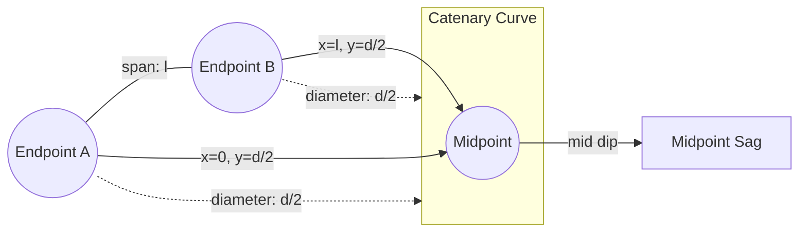

# Catenary Curve Optimisation

- [Catenary Curve Optimisation](#catenary-curve-optimisation)
  - [Overview](#overview)
    - [Visual Overview](#visual-overview)
  - [How It Works](#how-it-works)
  - [Usage](#usage)
    - [Importing the Catenary Class](#importing-the-catenary-class)
    - [Example](#example)
    - [Marimo Notebooks](#marimo-notebooks)
  - [Command Recipes (`justfile`)](#command-recipes-justfile)
  - [Testing](#testing)
  - [Applications](#applications)
  - [Catenary Class Consolidation](#catenary-class-consolidation)

## Overview

This project solves a mathematical optimisation problem for the **catenary curve**—the shape a flexible chain or cable takes when supported at its ends and acted on only by gravity. Catenaries are important in physics, engineering, and architecture (for example, suspension bridges, hanging cables, or hoops).

The code:
- **Finds the best-fit catenary parameters** (`a` and `b`) for given boundary conditions: a specified "diameter" (vertical position at endpoints) and "span" (distance between supports).
- **Calculates geometric properties** of the curve, such as the area under the curve and the midpoint sag ("dip").

### Visual Overview



- **Endpoints** are fixed at height `d/2` and separated by distance `l`.
- The **catenary curve** hangs between these points.
- The **midpoint** is where the curve sags the most ("mid dip").

---

## How It Works

1. **Catenary Equation:**  
   The curve is defined by  
   $$
   y = a \cdot \cosh\left(\frac{x - b}{a}\right)
   $$  
   where:
   - `a` controls the curve's sag,
   - `b` shifts the curve horizontally.

2. **Boundary Conditions:**  
   The curve starts at $(0, d/2)$ and ends at $(l, d/2)$, where $d$ is the diameter and $l$ is the span.

3. **Parameter Fitting:**  
   The algorithm uses a grid search to find the $a$ and $b$ that minimise the error at the endpoints.

4. **Property Calculation:**  
   Once fitted, the code computes:
   - Area under the curve,
   - Midpoint radius,
   - Midpoint dip (sag),
   - Midpoint gap.

---

## Usage

### Importing the Catenary Class

The core logic is consolidated in a single Python `Catenary` class.  

**To use in a Marimo notebook or script:**

```python
from community.bubble_cosh_databooth import Catenary
```

### Example

```python
cat = Catenary(diameter=1.0, span=0.6)
cat.fit_parameters()
print(cat.summary())
```

### Marimo Notebooks

- The class is **not redefined** in the notebook—simply import and use it.
- Notebooks focus on visualisation, interactivity, and exploration.

---

## Command Recipes (`justfile`)

This project uses a [`justfile`](https://just.systems) to simplify common tasks:

| Command            | Purpose                                                      |
|--------------------|-------------------------------------------------------------|
| `just`             | List all available recipes                                  |
| `just run-original-code` | Runs the original (legacy) script                      |
| `just run-new-code 1.1 0.7` | Runs the new, class-based code with custom arguments|
| `just mo-edit`     | Opens the Marimo notebook for editing                       |
| `just mo-run`      | Runs the Marimo notebook interactively                      |

---

## Testing

All tests for the `Catenary` class are written and maintained outside the notebook, using `pytest` for automated verification.

---

## Applications

- **Engineering design:** Hanging cables, ropes, or hoops between two points.
- **Physics simulations:** Real-world catenary modelling.
- **Architecture:** Analysing sag and area under arches or cables.

---

## Catenary Class Consolidation

The core `Catenary` class is **consolidated into a single, reusable Python module**. All computational logic, geometric methods, and optional plotting functionality are now maintained in one place for consistency and maintainability.

All tests are external, ensuring reliability and maintainability.

---

> **This code finds the best-fitting catenary curve between two points and calculates its properties, using a single, reusable class for all computations.**
